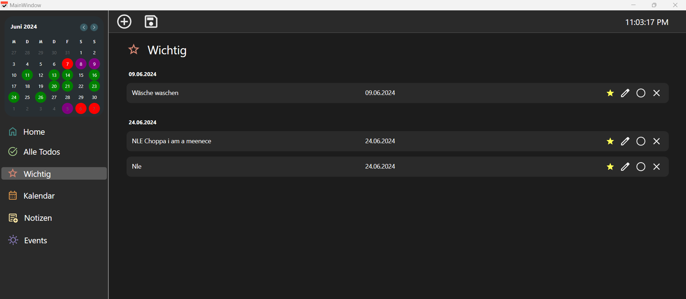

## Bedienungsanleitung mit Screenshot

1. Zu Beginn des Programms ist der User auf dem Home Window und es werden die Aufgaben des heutigen Tages angezeigt.

2. Die Frage ist jedoch, wie man ToDos überhaupt erstellt? Die Antwort lautet: Add Icon. Mit dem Icon, das oben platziert ist, kann man eine ToDo hinzufügen.

3. Nun poppt ein Fenster auf, bei dem man seine ToDo erstellen kann, mit dem jeweiligen Titel und dem Datum. Das Datum kann man entweder händisch eingeben oder per Icon-Click über dem Kalender das Datum auswählen.
   
    

4. Man kann auch die ToDos speichern. Nachdem man auf das Speichern-Icon klickt, öffnet sich ein Dialog, wo man die ToDos abspeichern kann.

    

5. Oben links ist ein Kalender, wo man seine ToDos sieht. Man kann zwischen den verschiedenen Monaten über die oben rechts stehenden Knöpfe wechseln.
 
   
6. Wenn man seine ToDo verändern will, kann man auf das Stift-Icon klicken, und schließlich poppt wieder ein Fenster auf, wo man es ändern kann.
 

7. Nun, wenn man viele ToDos hat, wird es schnell unübersichtlich. Deswegen gibt es die "Alle ToDos"-Ansicht, in der man alle Todos sehen kann. Um überhaupt in unterschiedliche Ansichten gehen zu können, muss man auf der unten links stehenden Navigation die jeweilige Ansicht per Mausklick auswählen.
   
    
   
8. Im Kalender sind nun unterschiedliche Farben. Wenn ein Tag grün ist, heißt es, dass dort eine ToDo fällig ist. Wenn ein Tag rot ist, bedeutet dies, dass an diesem Tag ein Feiertag ist. In beiden Fällen wird der Tag lila.

9.  Des Weiteren kann man ToDos als "Wichtig" markieren. Dazu kann man auch in einer Ansicht alle wichtigen ToDos sehen.
 

10. Wenn man weiter runter geht bei der Navigation zum Kalender, kann man den Kalender vergrößert ansehen mit den jeweiligen ToDos. Wenn man auf einen Tag klickt, wird man in der Home-Ansicht (im Kalender) auf den jeweiligen Tag weitergeleitet.
   

11. Oben bei der Bar gibt es noch zwei neue Knöpfe: Der linke Knopf ist dazu gedacht, dass man einen Monat zurück geht, und der rechte ist dazu gedacht, einen Monat vorzugehen.

12. Notizen können in dieser Anwendung auch erstellt werden, indem man in der Notizen-Ansicht auf das Plus klickt.
    
    
    

13. Dort kann man auch eine Notiz hinzufügen.

    

14. Beim Mülleimer-Icon kann man Notizen löschen.

15. Um alle Feiertage zu sehen, kann man die Events-Ansicht aufrufen.

    

16. Um die Ansicht zu vergrößern, kann man bei dem grauen Balken die Breite verändern.

    