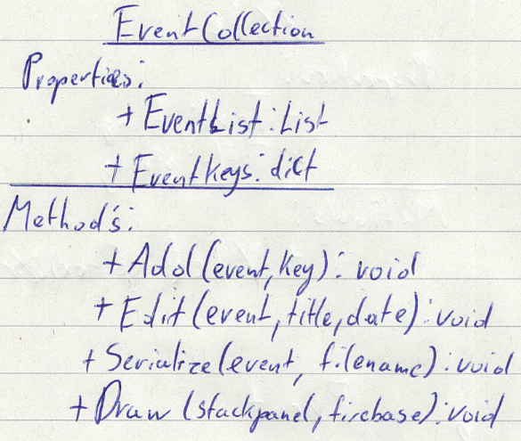

# Lastenheft (Rohat, Florian):
  Terminkalender mit integrierter Todo funktion

## Mindestanforderungen:
  Datenbank abspeichern
  Kalender Element
  Todo Funktion (pop up Fenster)
  Save to JSON
  Verschiedene Pages 
  Logging
  Monat Anzeigen
  Feiertage
  Edit

## Nice-To-Have:
  Notes (Notizen)
  Authenification
  Richtige Zeitzone
  Alarm (zu email oder SMS)
  (MAYBE API)
  Design Anpassbar zu Window Größe

## Don't Have:
  Mehrere Sprachen
  Servereinbindung
## Umsetzung:
- WPF für Grafische Elemente
  - Auf Stack/Wrap Panel
  - Kalenderelement (aus WPF) an linker Seite
  - Buttons In einer Leiste
  - Labels für Todos/Meetings
  - Icons für Buttons
  - ToDo Objekt? 
- Firebase als Datenbank

## Einteilung:
  Rohat
  - Todo Klasse plus anzeige
  - Todo Collection Klasse (Add, Remove, Edit Methoden etc.)
  - ToDo Task anzeige im Calender Object (Binding)
  - Allgemeines Design
  - Kalender Ansicht
  - Alle Todos ansicht

  Florian
  - Basic GUI (Kalender!)
  - Addwindow
  - Datenbank Bindung
  - Notizen 
  - Events 
  - (Wichtig wenn man Zeit hat)
  - Responsive Design

## Skitzen & Klassendiagramme
**Gui Sketch:**

 

**Todo Class:**

**TodoCollection:**

**Note Class:**

**NoteCollection:**

**Event Class:**

**EventCollection:**

**MainWindow:**

**AddTodo:**

**AddNote:**
